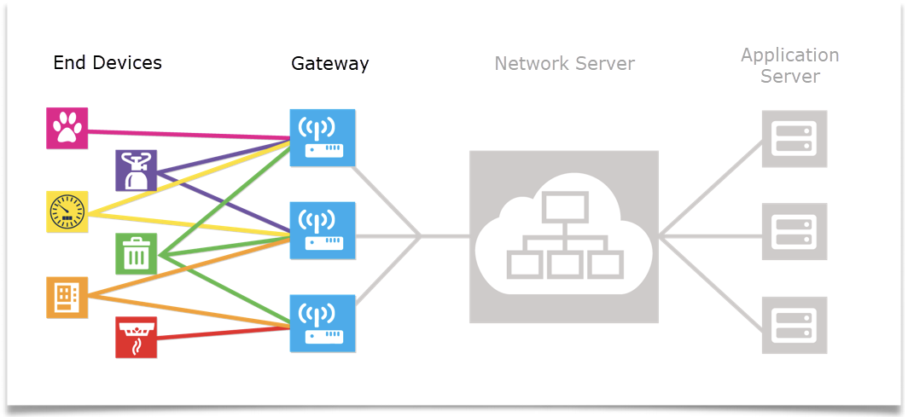

# H2O Degree OTS Documentation

### General 

[Overview](#overview)   
[LNS](#lns)  
[Provisioning](#provisioning)  
[Checklist](#checklist)  
[Product Box Document - Web View](product_doc.md) or [PDF](pdfs/product_doc.pdf)

### L54120
[Port 210/211](#210)  
[Port 212/213](#212)  
[Port 52](#52)  
    [Hardware Diagnostic Byte Bitmap](#52.1)  
    [Water Diagnostic Byte Bitmap](#52.2)  
    [Status Byte Bitmap](#52.3)  

###  L542xx
[Port 140/141/145](#14x)  
[Port 51](#51)  

<a name="overview"/>  

# Overview

OTS end devices not previously assigned to any LoRaWAN Network Server (LNS).
The device you purchased is an Off the Shelf (OTS) LoRaWAN end device.  It has not been provisioned onto any LoRaWAN Network Server.  In figure 1 below the OTS end device is one of the Pink, Purple, Yellow, Green, Orange or Red end devices.

Packets broadcast by end devices will be picked up by one or more gateways within the network as illustrated in Figure 2.  When deploying an OTS end device the customer is responsible to provide a gateway compatible with the LNS they intend to use.

Gateways have a multi-channel and multi data radio frequency device that can scan and detect packets on any of the active channels and then demodulate the packets.
Gateways are simply passage ways to the core LoRaWAN Network Server (LNS) and typically have no built-in intelligence.  Gateways typically have an Ethernet backhaul.  However, some gateways use 2G, 3G or 4G backhaul using standard cellular modems.

When the OTS end device is manufactured the following tasks are performed
The 16-byte APPKEY is inserted into NVM of the end device.  
An 8-byte APPEUI (same for all end devices of the same type) is inserted into the NVM of the end device.
The end device is NOT register or provisioned on any LoRaWAN Network Server (LNS)
Labels are generated for the end device.
Additional labels are created for the end device with the APPEUI, the APPKEY and the DEVEUI.

If the end device was not manufactured by H2O Degree, then keys and APPEUIs were created by the company that manufactured the device.  H2O Degree includes the same three numbers with the end device.  DevEUI, AppEUI and AppKey. Depending on the manufacturer they may or may not retain the keys if they are lost. Please keep copies of the keys in a secure location.

<a name="lns"/>  

# LNS

The LoRaWAN Network Server (LNS) is responsible for:
* Message consolidation: Multiple copies of the same data packet may reach the LNS.  The LNS must keep track of these.
* Routing messages sent from the LNS to the end device. The LNS decides which is the best route based on link quality.  
* Network control the link quality can also help the LNS decide what is the best spreading factor. (i.e., communication speed) for a given end device.  This is the Adaptive Data Rate (ADR) policy.
* Network and gateway supervision:  Gateways typically connect to the LNS via an encrypted Internet protocol.  Typically, the LNS has a supervision and provisioning interface used to provision new gateways and new end devices.

Finally, the LNS can connect to application servers.

Sometimes the network provider of the LNS and the application provider of the application server are the same entity in other cases they are not.
If you purchased an OTS end device you must provide your own gateways, LNS, and application server.
H2O Degree devices may have some configurable parameters. Your LNS and application server needs to be able to send messages to devices in the appropriate way for the class of device. ( Class A or Class C )

<a name="provisioning"/>  

# Provisioning

The OTS end device must first be commissioned on the LoRaWAN Network Server (LNS) of the customer’s choice.   H2O Degree products use the OTAA join method. The three numbers you need to have in order to commission the end device on the LNS are:

DevEUI  
AppEUI  
AppKey  

IMPORTANT: H2O Degree devices have a label that has the keys printed and in QR form. The QR code format is “DevEUI, AppEUI,AppKey”. If this label is lost the device will not be able to be provisioned. It is recommended that the label is scanned and pulled off and kept in a secure location. Leaving the key label on the device is not recommended. 
Once the end device is provisioned then it can join one or more gateways already connected to the LNS.
Off the Shelf (OTS) refers to the method that each end device uses in order to find a radio channel to communicate with a gateway.   The gateway is looking for end devices that want to join on one of the channels that it is using while at the same time the end devices are looking across a large number of radio bands and channels in order to find a channel to communicate with the gateway.  An OTS (Off the Shelf) end device has the responsibility to find gateway.

A typical gateway supports one band with 8 channels.  Here are the channels supported in the United States and Canada.
902.3 MHz to 914.9 MHz spaced at 200KHz (Upstream-64 channels) 
903 MHz to 914.2 MHz spaced at 1.6 MHz apart (Upstream- 8 channels) 
923.3 MHz to 927.5 MHz spaced at 600KHz apart (Downstream- 8 channels)
The OTS end device uses Over the Air Authentication (OTAA) to perform a Join Procedure via the gateway to the LNS.  The OTAA join request requires the APPEUI and the APPKEY.
Device stays inert(inactive) in sleep mode, unless the pull tab is pulled on the L542xx series (activating the device), or magnet is put on the L54120-OTS (activating the device). Every hour, join attempts are made on Lora Channel bands, one band at a time across all 64 channels in the following order  

Band 0 (Channels 0-7)  
Band 1 (Channels 8-15)  
Band 2 (Channels 16-23)  
....  
Band 7(55-63)  

<a name="checklist"/>  

# Checklist

- [ ] Check list to get an OTS end device up and running
- [ ] Create and account on the LNS if you do not already have an account.
- [ ] Provision the end device using the human readable key label or the QR code. The QR code format is “DevEUI, AppEUI,AppKey”
- [ ] Typically, you will need to create the decoder.  The various decoder data definitions are available at our web site. 
- [ ] H2O Degree uses FPort to provide hints to the product type , payload format and the transmission type. Specifics can be found in the decoder document.
- [ ] Configure an application server if you want the LNS to send data to another server
- [ ] Check that the gateway(s) you are using has been configured on the LNS.
- [ ] Check the gateway configured on the LNS is up and reporting to the LNS.
- [ ] Power up the end device.
- [ ] Magnet or trigger the end device to find the gateway channel and then perform an OTAA join with the LNS
- [ ] Log in to the LNS in order to view data from the OTS end device
- [ ] Log in to the application server to view data from the end device.

<a name="210"/>  

# L54120 Port 210/211 Aqura Point of Use Water Meter Commodity Packet  
For firmware version < 0.6 with born on date earlier than Oct 13th 2022  
Lora Port : 210 - Hourly , network setting ping or power up transmission  
LoRa Port: 211 - Magnet triggered transmission  

| Byte Index | Descriptipn | Data Type | Bitmap / Notes |
| --- | --- | --- | --- |
| 0 | Water gallons integer | 32-bit big endian unsigned int | |
| 1 | | | |
| 2 | | | |
| 3 | | | |
| 4 | Water gallons decimal | 8 bit big endian dec | value / 256 | 
| 5 | Flow events | 16-bit big endian unsigned int | |
| 6 | | | |
| 7 | Flow time minutes | 16-bit big endian unsigned int  | 
| 8 | | | |
| 9 | Transmit attempt count | 16-bit big endian unsigned int | 
| 10 | | | |

<a name="212"/>  

# L54120 Port 212/213 Aqura Point of Use Water Meter Commodity Packet
For firmware version >= 0.6 with born on date later than Oct 13th 2022
Lora Port : 212 - Hourly , network setting ping or power up transmission
LoRa Port: 213 - Magnet triggered transmission

| Byte Index | Descriptipn | Data Type | Bitmap / Notes |
| --- | --- | --- | --- |
| 0 | Water gallons integer | 32-bit big endian unsigned int | |
| 1 | | | |
| 2 | | | |
| 3 | | | |
| 4 | Water gallons decimal | 8 bit dec | value / 256 | 
| 5 | Flow events | 16-bit big endian unsigned int | |
| 6 | | | |
| 7 | Flow time minutes | 16-bit big endian unsigned int  | 
| 8 | | | |
| 9 | Battery VDC millivolts | 16-bit big endian unsigned int | 
| 10 | | | |

<a name="52"/> 

# L54120 Port 52 Aqura Point of Use Water Meter Heath Packet

Lora Port : 52 - Once every 23 transmissions

| Byte Index | Descriptipn | Data Type | Bitmap / Notes |
| --- | --- | --- | --- |
| 0 | Hardware diagnostic | 8-bit bitmap | see table 52.1 |
| 1 | Water diagnostic | 8-bit bitmap | see table 52.2 |
| 2 | Temperature fahrenheit | 8-bit big endian unsigned int | |
| 3 | Reset code |  8-bit big endian unsigned int  | |
| 4 | Battery voltage | 16-bit big endian unsigned int | (value +200)/100 | 
| 5 | | | |
| 6 | Status byte | 8-bit bitmap | see table 52.3 |
| 7 | Reset count | 16-bit big endian unsigned int  | 
| 8 | | | |
| 9 | Transmit attempt count | 16-bit big endian unsigned int | 
| 10 | | | |

<a name="52.1"/> 

## Table 52.1 : L54120 Hardware Diagnostic Byte Bitmap

| Bit | Descriptipn |
| --- | --- |
| 0 | 1 if Main Baby Board Missing, 0 if Main Baby Board is detected.|
| 1 | Undefined|
| 2 | 1 if Didn't receive NetworkKey during Join Process|
| 3 | 1 if the WaterMeter is in Aggressive Tx mode|
| 4 | 1 if Second Baby Board Missing, 0 if Second Baby Board is detected.|
| 5 | Deep Sleep Enabled (1 : Enabled via Write packet from production, 0 : disabled )|
| 6 | Undefined | 
| 7 | Undefined | 

<a name="52.2"/> 

## Table 52.2 : L54120  Water Diagnostic Byte Bitmap

| Bit | Descriptipn |
| --- | --- |
| 0 | 1 if there is no flow for 30 days, 0 when flow is detected. |
| 1 | undefined |
| 2 | undefined |
| 3 | 1 if continuous flow for 5 hours. 0 when continuous flow is stopped |
| 4 | 1 if continuous intermittent flow for 24 hours. 0 when when cont. int. flow is stopped |
| 5 | 1 after detecting a low flow for 1 hour. 0 when low flow is stopped |
| 6 | Undefined |
| 7 | Undefined |

## Table 52.3 : L54120 Status Byte Bitmap

<a name="52.3"/> 

| Bit | Descriptipn |
| --- | --- |
| 7 MSB |  Magnet Flag 1 = magnet generated packet,  0 = not a magnet generated packet |
| 6,5,4 | Major firmware number |
| 3,2,1 | Minor firmware number |
| 0 |  Power up packet flag 1 = power up | 0 = not power up |

<a name="14x"/> 

# L542xx Port 14x Series Dry Contact Pulse Meter Commodity Packet

Lora Port : 140 - Hourly , network setting ping or power up
LoRa Port: 141/145 - Magnet triggered transmission

| Byte Index | Descriptipn | Data Type | Bitmap / Notes |
| --- | --- | --- | --- |
| 0 | Channel 1 pulse count | 32-bit big endian unsigned int | |
| 1 | | | |
| 2 | | | |
| 3 | | | |
| 4 | Channel 2 pulse count | 32-bit big endian unsigned int | value / 256 | 
| 5 | | | |
| 6 | | | |
| 7 | | | | 
| 8 | Battery voltage | 8-bit big endian unsigned integer | (value +200)/100 |
| 9 | Transmit attempt count | 16-bit big endian unsigned int | 
| 10 | | | |

<a name="51"/> 

# L542xx Port 51 Series Dry Contact Pulse Meter Heath Packet

Lora Port : 51 - Once every 23 transmissions

| Byte Index | Descriptipn | Data Type | Bitmap / Notes |
| --- | --- | --- | --- |
| 0 | Reserved | 8-bit | not used |
| 1 | Reserved | 8-bit | not used |
| 2 | Microchip mac staatus flags | 32-bit big endian bitmap |  Stack dependent. See table 51.1 |
| 3 | | | |
| 4 | | | | 
| 5 | | | |
| 6 | Status byte  | 8-bit bitmap | |
| 7 | Reset count |  16-bit big endian unsigned int  | |
| 8 | | | |
| 9 | Transmit attempt count | 16-bit big endian unsigned int | 
| 10 | | | |

## Table 51.1 : L54230 Status Byte Bitmap

Stack document: https://ww1.microchip.com/downloads/en/DeviceDoc/40001784B.pdf

| Bit | Descriptipn |
| --- | --- |
| 7 MSB |  Unused  |
| 6,5,4 | Major firmware version |
| 3,2,1 | Stack version - if 5(b101) → v1.0.5 of the Microchip Stack, if 3(b011) → v1.0.3 of the Microchip Stack |
| 0 |  Unused |

